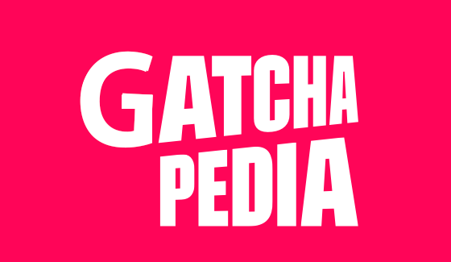

# Gotchapedia

우리는 가짜피디아가 아닙니다. 왓챠피디아 클론을 통해 성장의 기쁨을 깨닫고, 코딩의 즐거움을 알게하는 **Gotcha**피디아를 만듭니다.
  
 
---

## 왓챠피디아
- [왓챠피디아](https://pedia.watcha.com/ko-KR/) 사이트
- 소개: 왓챠피디아는 영화, TV프로그램, 책을 다루는 <u>콘텐츠 개인화 추천 사이트</u>입니다. 모두의 다름이 인정받고 개인의 취향이 존중받는 더 다양한 세상을 만들겠다는 목표로 사업을 확장해가고 있습니다. 단순한 큐레이팅이 아닌, 사용자의 데이터를 기반으로 추천하며 SNS처럼 팔로우, 좋아요, 코멘트 기능이 복합적으로 들어있습니다. 

## 팀원
코딩의 희로애락을 함께한 팀원을 소개합니다.
- Front-end: 고은정(PM), 김병준, 김태현
- Back-end: 고수희, 이영주, 장규석

## 개발 기간
- 기간: 2020.11.16 ~ 2020.11.27 (11일)

## 적용 기술
- Front-end: React.js(Class), React-router, React-slick, SASS
- Back-end: Django, Python, MySQL, jwt, bcrypt

## 구현 기능
- 네비바: 회원가입, 로그인/로그아웃, 검색, 반응형 미디어 쿼리
- 메인: 사용자에 따른 영화 콜렉션 매핑
- 영화 상세 페이지: 영화 좋아요, 보고싶어요 기능, 영화 별점 기록 기능, 영화 댓글과 대댓글 작성 및 수정 기능, 영화 관련 Youtube 비디오 클립 제공, 슬릭 슬라이더 사용
- 마이 페이지: 유저가 평가한 영화 목록, '좋아요' 목록, '보고싶어요' 목록 리스팅
- 취향 분석: 평가한 영화의 별점 그래프, 영화 태그의 워드 클라우드, 좋아하는 영화 배우, 감독 슬릭 슬라이더 리스팅, 선호 국가 및 장르 리스팅, 총 영화 감상시간 표시.

## 영상
(완성 후 등록 예정)

## 개인 역할
`고수희`
- Database Modeling, 별점 CRUD, 댓글 CRUD, 댓글-좋아요 CRUD, 영화 상세 정보 endpoint 

`고은정`
- 적어주세요

`김병준`
- 적어주세요

`김태현`
- 영화 상세페이지 작성

`이영주`
- Database Modeling, 회원가입, 로그인, 사용자 CRUD, 영화/사용자 별점 분포도 endpoint

`장규석`
- Database Modeling, 사용자 선호 장르/국가 평점 endpoint, 사용자 선호 영화 endpoint, 관심영화 CRUD,  

## 소감 및 후기
- 고수희: 개발자로서 진행된 첫 팀 프로젝트. 그 시작을 갓챠피디아 팀원분들과 함께해서 무척 즐겁고 의미가 깊었습니다. 2주가 짧고도 길었지만 귀중한 시간 속 얻었던 경험들과 추억들로 인해 더 성장할 수 있었습니다.
모두들 감사드리며, 앞으로의 행보를 늘 응원합니다.  

- 고은정: 이 한 번의 프로젝트는 앞으로 겪을 수많은 프로젝트의 첫 단추. 비록 찰나의 2주였지만 PM으로서, 한 명의 인간으로서 많이 배웠습니다. 감사합니다. 스파르타밖에 없던 갓챠피디아. 여러분의 그 스피릿을 잊지 않겠습니다. 앞으로도 계속 스파르타로 남아주세요. 스파르타!! ([후기](https://업로드후수정.com)-개인 벨로그)

- 김병준: 나의 첫 팀프로젝트, 처음인지라 모든게 미숙하게 뜻대로 안되어 속상하고 도전적인 기능을 추가하려고 시도했지만 실패해서 아쉬운 부분이 많았으나 그런 원인들을 복기 해가며 많은 것을 배우며 저의 부족한 부분도 찾을 수 있는 좋은 계기였습니다. 비록 이번 프로젝트 때 제 파트들은 어설프고 대단한 기능들을 실현 한건 아니지만 세상에 처음부터 위대한 탄생이 없듯 포기하지 않고 끝까지 최선을 다하는 개발자가 되겠습니다. 2주간 미숙한 저 땜에 고생하신 팀원분들 그리고 고민 할때 마다 옆에서 도와주신 멘토님들 정말로 감사드립니다. ([후기](https://velog.io/@kingdavid1108)-개인블로그(계속 업로드중)) 

- 김태현: 2주가 어떻게 지났는지 모를만큼 정신없던 하루들의 연속이었습니다. 처음으로 제대로 분업 하면서 프로젝트 다운 프로젝트를 해봤는데 인격적으로나 실력적으로나 많이 성장한 것 같습니다. 프로젝트를 하면서 서로 다른 사람들이 모여서 하나의 공통된 프로젝트를 만드는 과정이 마치 감독은 여러명이지만 하나의 주제를 관통하는 옴니버스 영화를 찍는것과 비슷하다고 줄곧 생각했습니다. 우리가 만들어가는 영화의 결말이 배드엔딩이 되진 않을까 위기도 많았고 매일매일 조마조마했지만 그래도 괜찮은 결말로 마무리 지은것 같아 다행입니다. 다들 고생이 너무 많았고 2차 프로젝트 때 좋은 사람들과 좋은 결과물 내셨으면 좋겠습니다.

- 이영주: 첫 프로젝트를 진행하면서 설렘과 걱정이 공존했는데 생각했던 것을 생각만큼 다 해내지는 못했지만 팀원들 덕분에 힘들지만 즐겁게 할 수 있었습니다. 다음에 기회가 된다면 같이 더 좋은 결과를 이루어냈으면 좋겠습니다! 갓챠 갓챠 화이팅!

- 장규석: 혼자서 하는 것보다 같이 함으로써 얻어지는 경험이 더 값지다는 것을 느끼게된 2주였습니다. 2주 동안 팀원들과 고생했던 하루하루가 너무 좋은 추억이 되었고, 직접 사이트 클론을 하면서 이론적으로만 알던내용들을 몸으로 익힐 수 있는 귀중한 시간이었습니다. 갓챠! 갓챠! 화이팅!

## 레퍼런스
- 이 프로젝트는 [왓챠피디아](https://pedia.watcha.com/ko-KR/) 사이트를 참조하여 학습목적으로 만들었습니다.
- 실무수준의 프로젝트이지만 학습용으로 만들었기 때문에 이 코드를 활용하여 이득을 취하거나 무단 배포할 경우 법적으로 문제될 수 있습니다.
- 이 프로젝트에서 사용하고 있는 사진 대부분은 위코드에서 구매한 것이므로 해당 프로젝트 외부인이 사용할 수 없습니다.

